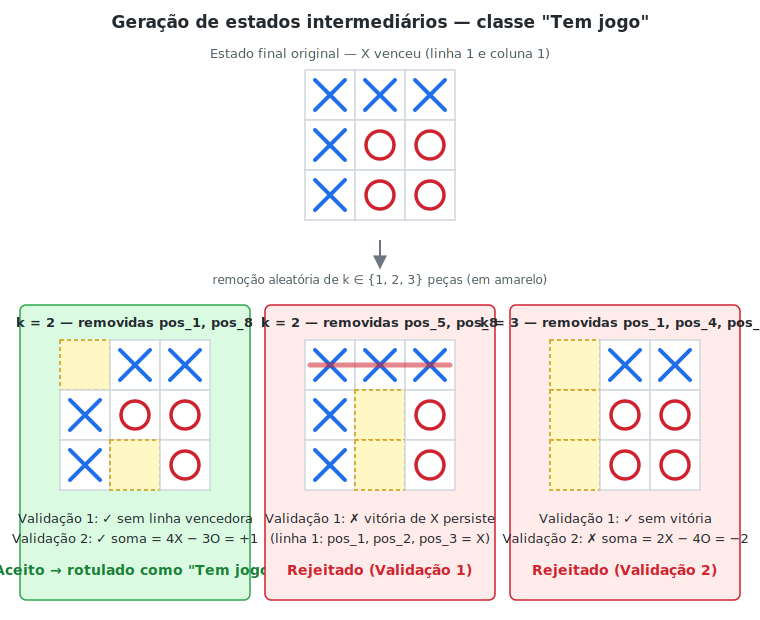
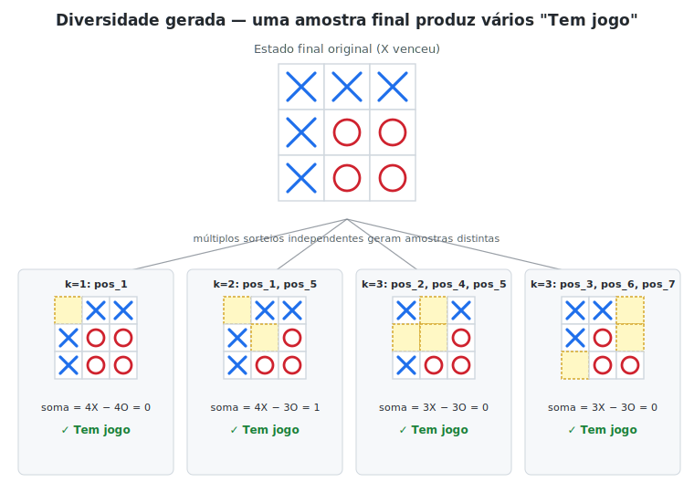

# Tic-Tac-Toe com Machine Learning

**Disciplina:** PUCRS — Inteligência Artificial
**Professora:** Silvia Moraes
**Código de identificação:** t32

---

## Resumo

Este trabalho apresenta um sistema de classificação supervisionada para o jogo da velha cuja função é, dado um tabuleiro 3×3 em qualquer estado, determinar se o jogo está em andamento, terminou em vitória de X, em vitória de O, ou em empate. O ponto de partida é o *UCI Tic-Tac-Toe Endgame Dataset*, que contém apenas configurações finais distribuídas em três classes desbalanceadas. Para atender ao enunciado, que exige a classificação em quatro classes (incluindo `Tem jogo`), o conjunto foi expandido por meio de duas estratégias: espelhamento aritmético dos empates e geração validada de estados intermediários por engenharia reversa. O resultado é um dataset de 1.600 amostras numéricas, dividido fisicamente em treino, validação e teste com estratificação por classe. Foram treinados, validados e avaliados seis algoritmos clássicos: k-NN, Árvore de Decisão, MLP, Random Forest, SVM e XGBoost. Em conjunto com a etapa de modelagem, foi desenvolvida uma aplicação Streamlit que permite jogar contra um bot aleatório enquanto qualquer um dos modelos atua como analista em tempo real, registrando histórico, simulações em massa e correções para retreinamento futuro. O melhor modelo no conjunto de teste foi o XGBoost (99,17 % de acurácia, F1-macro = 0,935).

---

## 1. Introdução

O jogo da velha é um problema clássico, plenamente determinístico e finito (765 estados únicos a menos de simetria, 26.830 sequências distintas de jogo). Apesar disso, é um terreno fértil para experimentos didáticos de aprendizado de máquina: as features são poucas (nove células), o espaço de classes é pequeno e bem definido, e a estrutura combinatória do problema permite construir baselines analíticos para confrontar com os modelos.

O objetivo aqui não é construir um agente que jogue, mas sim um *analista*: dado um tabuleiro, retornar uma das quatro classes — `Tem jogo`, `X venceu`, `O venceu` ou `Empate`. O trabalho cobre o ciclo completo de um projeto supervisionado: análise exploratória, tratamento e enriquecimento dos dados, divisão estratificada, treinamento e ajuste de seis algoritmos, comparação rigorosa em conjunto de teste isolado, e a entrega de uma aplicação interativa que consome os modelos serializados.

---

## 2. Dataset

### 2.1 Origem

Foi utilizado o *Tic-Tac-Toe Endgame Dataset* da UCI Machine Learning Repository (Aha, 1991). O conjunto contém 958 configurações únicas e legais de fim de partida, sob o pressuposto de que o jogador X jogou primeiro. Cada amostra é descrita por nove atributos categóricos `pos_1, pos_2, ..., pos_9`, correspondentes às nove células do tabuleiro varridas linha a linha, com domínio `{x, o, b}` (X, O, vazio).

A variável-alvo original é binária — `positive` indica vitória de X, `negative` indica qualquer outro desfecho. Essa codificação não distingue entre derrota de X e empate, o que constitui o primeiro problema do dataset frente ao enunciado.

### 2.2 Análise Exploratória

A reclassificação manual das 958 instâncias por meio das oito linhas vencedoras (três linhas, três colunas, duas diagonais) revelou a seguinte distribuição:

| Classe original | Classe inferida | Amostras | Proporção |
|---|---|---:|---:|
| `positive` | X venceu | 626 | 65,3 % |
| `negative` | O venceu | 316 | 33,0 % |
| `negative` | Empate | 16 | 1,7 % |

A verificação `df.duplicated()` sobre as nove posições confirmou que não há configurações repetidas. A análise de frequência por posição mostrou que X aparece em maior número em todas as nove células, reflexo direto de jogar primeiro. A correlação com o resultado revelou que a célula central (`pos_5`) é a mais informativa: ocupada por X, está positivamente correlacionada com vitória de X; ocupada por O, a correlação é negativa.

Dois problemas saltaram dessa análise:

1. **Classe ausente.** O dataset cobre apenas estados de fim de jogo, portanto a classe `Tem jogo` (estados intermediários, com pelo menos uma célula vazia e nenhum vencedor) não existe nele.
2. **Severo desbalanceamento.** A classe `Empate`, com 16 amostras, é vinte vezes menor que `X venceu`. Isso, combinado com uma divisão treino/validação/teste, deixa pouquíssimas amostras de empate no conjunto de teste e prejudica métricas dependentes da classe minoritária.

---

## 3. Preparação dos Dados

A pipeline de preparação foi implementada no notebook `02_preprocessing.ipynb` em quatro etapas modulares.

### 3.1 Padronização Numérica

Os valores categóricos foram mapeados para inteiros simétricos em torno de zero:

| Símbolo | Valor numérico | Significado |
|---|---:|---|
| `x` | +1 | Marca de X |
| `o` | −1 | Marca de O |
| `b` | 0 | Vazio |

A escolha de uma codificação simétrica (em vez de one-hot ou ordinal arbitrária) não foi cosmética: ela permite que a soma das células ao longo de uma linha, coluna ou diagonal seja diretamente interpretável. Uma soma de +3 indica vitória de X naquela linha; −3, vitória de O. Essa propriedade é explorada pela função `classificar_vitoria(board)`, que age como árbitro durante o data augmentation.

### 3.2 Expansão da Classe `Empate`

Como o dataset original contém apenas 16 empates, foi aplicada uma transformação algébrica que aproveita a simetria do jogo: para cada empate, multiplica-se o tabuleiro inteiro por −1. Isso troca todos os X por O e vice-versa, gerando uma configuração diferente, sintaticamente válida e ainda classificável como empate. A operação dobra a classe para 32 amostras, que é o total de empates únicos possíveis no jogo da velha (a ordem de jogadas importa, mas o estado final em si está limitado a essa quantidade após considerar a simetria de cor).

### 3.3 Geração de Estados Intermediários (`Tem jogo`)

A criação da classe ausente foi implementada por engenharia reversa. Para cada configuração de fim de jogo do dataset original:

1. Copia-se o tabuleiro.
2. Sorteia-se um número *k* entre 1 e 3 e removem-se aleatoriamente *k* peças, transformando-as em zero.
3. Aplica-se a função `classificar_vitoria` no resultado: se ainda houver uma linha vencedora, a configuração é descartada (uma vitória "fica de pé" mesmo após removermos peças não-pertencentes à linha, e queremos apenas estados sem vencedor).
4. Verifica-se a *validade do turno*: a soma das células deve ser 0 ou 1. Como X joga primeiro e cada jogador alterna turnos, em qualquer estado intermediário válido o número de X é igual ao de O (soma 0) ou maior em uma unidade (soma 1). Configurações com soma 2 (X jogou duas vezes seguidas) ou negativa (O jogou primeiro) são impossíveis em uma partida real e são descartadas.
5. A configuração aprovada nos dois testes é rotulada como `Tem jogo`.

A Figura 1 ilustra o pipeline aplicado a três candidatos derivados do mesmo estado final. À esquerda, um candidato é aceito (passa nas duas validações). No centro, um candidato é rejeitado pela Validação 1 porque a vitória da linha superior persiste mesmo após a remoção das peças sorteadas. À direita, um candidato é rejeitado pela Validação 2 porque o saldo de peças (2 X contra 4 O) é impossível em uma partida real onde X joga primeiro.



*Figura 1 — Aplicação das duas validações sobre três candidatos sorteados a partir do mesmo estado final. As células em amarelo tracejado indicam as posições removidas pelo sorteio. A linha vermelha no painel central destaca a vitória que sobreviveu à remoção.*

O processo é repetido várias vezes por amostra original — cada sorteio independente de *k* e de quais peças remover produz uma amostra `Tem jogo` distinta. A Figura 2 mostra quatro saídas válidas obtidas a partir do mesmo endgame, evidenciando como uma única configuração final pode se desdobrar em múltiplas amostras intermediárias.



*Figura 2 — Quatro estados intermediários distintos e válidos derivados do mesmo endgame de origem. Cada um passou nas duas validações e foi rotulado como `Tem jogo`. A combinação de k variável (1 a 3) com sorteio aleatório das posições garante a diversidade do conjunto gerado.*

No final, a classe é truncada de modo a igualar o tamanho da maior classe existente (626, mesma cardinalidade de `X venceu`), evitando que `Tem jogo` domine o dataset por excesso de amostras geradas.

### 3.4 Distribuição Final e Limpeza

Após o pipeline, foi executado um `drop_duplicates` global sobre as nove posições para garantir que nenhuma configuração apareça em mais de uma classe (as remoções aleatórias da etapa 3.3 poderiam, em teoria, gerar um estado também presente no dataset original). O dataset final, salvo em `data/processed/preprocessed_1.csv`, contém 1.600 amostras assim distribuídas:

| Classe | Amostras | Proporção |
|---|---:|---:|
| X venceu | 626 | 39,1 % |
| Tem jogo | 626 | 39,1 % |
| O venceu | 316 | 19,8 % |
| Empate | 32 | 2,0 % |

O desbalanceamento residual da classe `Empate` é estrutural e não pode ser resolvido sem invenção de dados sintéticos não fundamentados — é uma característica inerente à combinatória do jogo. As métricas reportadas mais adiante são, por isso, apresentadas tanto na forma agregada (acurácia, F1 ponderado) quanto na desagregada (F1 por classe, F1 macro), para evitar que o desempenho na classe minoritária fique mascarado.

### 3.5 Split Físico Treino / Validação / Teste

Atendendo à exigência do enunciado de que todos os algoritmos sejam comparados sobre os mesmos conjuntos, a divisão foi materializada em arquivos físicos e gerada uma única vez pelo script `notebooks/PREPROCESS/03_split_dataset.py`. Foi adotada uma proporção 70 / 15 / 15 com `random_state=42` e `stratify` pela coluna `classe`, garantindo que as quatro classes apareçam nos três conjuntos na mesma proporção do dataset original:

| Conjunto | Amostras | X venceu | Tem jogo | O venceu | Empate |
|---|---:|---:|---:|---:|---:|
| Treino | 1.119 | 438 | 438 | 221 | 22 |
| Validação | 241 | 94 | 94 | 48 | 5 |
| Teste | 240 | 94 | 94 | 47 | 5 |

Os arquivos `train.csv`, `val.csv` e `test.csv` ficam em `data/splits/` e são consumidos diretamente por todos os notebooks de modelagem. Adicionalmente, em todos os notebooks o `LabelEncoder` é ajustado *apenas* sobre o rótulo de treino e reaplicado nos demais via `transform`, eliminando qualquer vazamento de informação.

---

## 4. Modelos

Foram treinados seis algoritmos. Em todos eles a metodologia foi padronizada: o ajuste de hiperparâmetros, quando aplicável, ocorre via `GridSearchCV` com validação cruzada de cinco *folds* sobre o conjunto de treino; a avaliação preliminar acontece sobre o conjunto de validação; e a métrica final é reportada apenas uma vez sobre o conjunto de teste, que permanece intocado durante o tuning.

### 4.1 k-Nearest Neighbors (k-NN)

O k-NN é um algoritmo *lazy* baseado em instâncias: ele não constrói um modelo paramétrico durante o treino, apenas armazena as amostras. Para classificar um novo exemplo, calcula as distâncias até todos os pontos de treino e atribui à amostra a classe majoritária entre os *k* vizinhos mais próximos. Funciona bem em espaços de baixa dimensão com fronteiras de decisão suaves; sofre quando há classes desbalanceadas (vizinhos majoritários tendem a engolir classes raras) e quando as features têm escalas muito diferentes.

A busca varreu valores de *k* entre 1 e 30 com `cv=5` e métrica de acurácia. O melhor *k* encontrado foi **6**.

### 4.2 Árvore de Decisão

Uma árvore de decisão particiona recursivamente o espaço de features escolhendo, em cada nó, a feature e o limiar que maximizam a redução de impureza (Gini ou Entropia). É altamente interpretável e captura interações não-lineares entre features sem necessidade de transformação prévia, mas tende ao overfitting se não for podada.

Os hiperparâmetros adotados foram `criterion='gini'`, `min_samples_leaf=2` e `max_depth=None` (sem limite, com a poda governada pelo critério de folhas). O `random_state=42` garante reprodutibilidade.

### 4.3 Multi-Layer Perceptron (MLP)

A MLP é uma rede neural feed-forward com camadas totalmente conectadas. A arquitetura adotada tem duas camadas ocultas de **64 e 32 neurônios** com ativação ReLU, otimizador Adam, máximo de 1.000 iterações e `random_state=42`. A escolha por uma topologia decrescente (64 → 32) é uma heurística clássica de afunilamento que força a rede a comprimir gradualmente a representação à medida que se aproxima da camada de saída.

A escala simétrica das features (−1, 0, +1) é favorável a redes com ativação ReLU, e por isso não foi aplicada normalização adicional.

### 4.4 Random Forest

Random Forest constrói um ensemble de árvores treinadas com bootstrap das amostras (bagging) e seleção aleatória de features em cada split. A classificação final é a moda das previsões individuais. O ensemble reduz a variância das árvores individuais sem aumentar muito o viés, e geralmente exige pouco ajuste fino para entregar boa performance.

A busca em grade explorou:

```
n_estimators      ∈ {100, 200, 300}
max_depth         ∈ {None, 10, 20}
min_samples_split ∈ {2, 5}
min_samples_leaf  ∈ {1, 2}
class_weight      ∈ {'balanced', None}
```

Com a métrica `f1_weighted` (que pondera o F1 pela frequência das classes, sendo mais informativa que acurácia em datasets desbalanceados), a melhor configuração encontrada foi `n_estimators=200`, `max_depth=10`, `min_samples_split=5`, `min_samples_leaf=1`, `class_weight='balanced'`. O parâmetro `class_weight='balanced'` é decisivo aqui: ele atribui peso inversamente proporcional à frequência de cada classe durante o treino, compensando explicitamente o desequilíbrio da classe `Empate`.

### 4.5 Support Vector Machine (SVM)

O SVM busca o hiperplano de margem máxima que separa as classes. Para problemas não linearmente separáveis, o *kernel trick* projeta implicitamente os dados em um espaço de maior dimensão onde a separação se torna possível, sem o custo computacional de calcular essa projeção explicitamente. No modo multiclasse, é usado o esquema *One-vs-Rest*: um classificador binário por classe, e a classe com maior score de decisão é eleita.

O SVM é fortemente sensível à escala das features (a margem e o kernel RBF dependem de distâncias euclidianas), portanto foi encapsulado em um `Pipeline` que aplica `StandardScaler` antes do `SVC`. Isso tem o benefício adicional de tornar o `.pkl` autossuficiente: a aplicação chama `model.predict(tabuleiro_bruto)` sem precisar replicar a normalização.

A busca explorou:

```
svc__C            ∈ {0.1, 1, 10, 100}
svc__kernel       ∈ {'rbf', 'linear'}
svc__gamma        ∈ {'scale', 'auto'}
svc__class_weight ∈ {'balanced', None}
```

A melhor configuração foi `C=100`, `kernel='rbf'`, `gamma='scale'`. O `C=100` indica uma penalidade alta para erros de classificação, levando a uma margem mais estreita e ajuste mais firme aos dados de treino — viável aqui porque o problema é, em essência, geométrico e bem comportado.

### 4.6 XGBoost (Gradient Boosting)

XGBoost é uma implementação otimizada de gradient boosting sobre árvores. Diferente do bagging, o boosting treina árvores *sequencialmente*: cada nova árvore foca nos exemplos que as anteriores erraram. O modelo soma essas correções progressivas com uma taxa de aprendizado controlada.

A configuração adotada foi `n_estimators=200`, `learning_rate=0.1`, `max_depth=4`, `eval_metric='mlogloss'`. Foi habilitado `early_stopping_rounds=20` usando o conjunto de validação como sinal: o treinamento para automaticamente se a perda na validação não melhorar por 20 rodadas consecutivas. Esse mecanismo dispensa a necessidade de buscar manualmente o melhor `n_estimators` e age como regularização contra overfitting.

---

## 5. Resultados

Todos os modelos foram avaliados sobre o mesmo conjunto de teste de 240 amostras, intocado durante o ajuste de hiperparâmetros.

### 5.1 Métricas Globais

| Modelo | Acurácia | F1-macro | F1-weighted |
|---|---:|---:|---:|
| k-NN (k=6) | 0,8208 | 0,6173 | 0,8097 |
| Árvore de Decisão | 0,7833 | 0,6615 | 0,7892 |
| MLP (64, 32) | 0,9167 | 0,6981 | 0,9080 |
| Random Forest | 0,9292 | 0,9095 | 0,9279 |
| SVM (RBF, C=100) | 0,9750 | 0,8770 | 0,9758 |
| **XGBoost** | **0,9917** | **0,9349** | **0,9907** |

### 5.2 F1 por Classe (Conjunto de Teste)

| Modelo | Empate | O venceu | Tem jogo | X venceu |
|---|---:|---:|---:|---:|
| k-NN | 0,000 | 0,804 | 0,743 | 0,923 |
| Árvore de Decisão | 0,308 | 0,680 | 0,773 | 0,885 |
| MLP | 0,000 | 0,948 | 0,890 | 0,954 |
| Random Forest | 0,833 | 0,959 | 0,901 | 0,945 |
| SVM | 0,545 | 1,000 | 0,968 | 0,995 |
| XGBoost | 0,750 | 1,000 | 0,989 | 1,000 |

### 5.3 Discussão

A leitura conjunta das duas tabelas revela três regimes de comportamento. Os modelos mais simples — k-NN e Árvore de Decisão — atingem acurácias razoáveis (78–82 %) mas falham completamente na classe `Empate`: o k-NN registra F1 = 0 porque os 5 exemplos de empate no teste sempre têm vizinhos majoritários de outras classes; a árvore consegue um F1 modesto de 0,308 graças à capacidade de criar regiões pequenas e específicas, mas ainda assim erra a maioria. A MLP eleva a acurácia para 91,7 % mas, paradoxalmente, regride na classe minoritária (F1 = 0): a função de custo padrão da MLP é dominada pelas classes majoritárias e não há mecanismo automático para compensar.

Os três modelos do regime intermediário a alto — Random Forest, SVM e XGBoost — operam acima de 92 %. Random Forest se destaca como o **melhor classificador da classe minoritária** (F1 = 0,833 em `Empate`), graças ao `class_weight='balanced'`, ainda que sua acurácia global (92,9 %) seja menor que a do SVM e do XGBoost. Esse é um trade-off explícito: ao priorizar a classe rara durante o treino, o RF aceita um pequeno sacrifício nas classes majoritárias.

O XGBoost combina a melhor acurácia global (99,17 %) com um F1 sólido em `Empate` (0,750) e desempenho próximo do perfeito nas demais classes. O SVM o segue de perto em acurácia (97,5 %) mas erra mais em `Empate` (F1 = 0,545), o que derruba seu F1-macro para 0,877.

Como métrica de desempate, o **F1-macro** é a leitura mais honesta para este problema, pois trata as quatro classes com peso igual independentemente da frequência. Por essa métrica, **XGBoost (0,935) > Random Forest (0,910) > SVM (0,877)**. A escolha do modelo "campeão" depende da prioridade: se o objetivo é minimizar erros agregados, XGBoost; se a prioridade é a classe rara, Random Forest. Para o uso prático no app, o XGBoost foi adotado como referência.

Vale notar que os desempenhos se alinham com a literatura clássica do dataset, em que algoritmos sofisticados (CN2, IB3-CI nos experimentos de Aha, 1991) atingiam acurácias acima de 98 %. A diferença é que aqui o problema é de quatro classes em vez de duas, e mesmo assim o XGBoost mantém o patamar.

---

## 6. Aplicação Streamlit

Em paralelo à modelagem, foi desenvolvida uma aplicação interativa em Streamlit (`app/main.py`) que cumpre dois papéis: atender ao requisito de front-end do enunciado, e servir como laboratório vivo para testar e comparar os modelos em condições não vistas durante o treino. A aplicação descobre dinamicamente os modelos disponíveis varrendo a pasta `models/` — cada subpasta com um par `(modelo.pkl, encoder.pkl)` aparece automaticamente no seletor da barra lateral.

A aplicação está organizada em cinco abas:

**Jogo (Humano vs Bot).** O usuário joga como X contra um bot que sorteia jogadas válidas. A cada clique, o tabuleiro é vetorizado e enviado ao modelo selecionado, que prevê o estado do jogo. A previsão é exibida lado a lado com o estado real (calculado por uma função-juiz determinística), permitindo verificar visualmente o acerto. Ao final da partida é calculada a acurácia daquele jogo específico (acertos / jogadas avaliadas) e a partida é registrada com origem `manual`.

**Simulação (Máquina vs Máquina).** Duas máquinas jogam aleatoriamente entre si por *N* partidas configuráveis (1 a 500). O modelo selecionado classifica cada estado intermediário do tabuleiro, e cada erro é automaticamente persistido no `dataset_correcoes.csv` junto com o nome do modelo, a previsão errada, a classe real e um timestamp. O painel de resultados exibe acurácia global, média, desvio padrão, distribuição dos resultados das partidas, gráfico de acurácia por partida, matriz de confusão agregada dos erros e drill-down jogada-a-jogada de qualquer partida.

**Histórico.** Todas as partidas (manuais e simuladas) são gravadas em `data/historico/historico_partidas.json` de forma incremental. A aba oferece filtros por modelo, resultado e origem, KPIs (total de partidas, win rate de X, acurácia média, melhor partida), gráfico de dispersão da acurácia ao longo do tempo, tabela detalhada de partidas e drill-down jogada-a-jogada com matriz de confusão dos erros de cada partida.

**Comparação de Modelos.** Tabela comparativa com acurácia média e global, desvio padrão, mínimo e máximo por modelo, gráfico de barras da acurácia global, análise de erros (matriz de confusão, distribuição por status real e por previsão incorreta) e comparação direta entre dois modelos com gráfico de evolução partida a partida.

**Dataset de Correções.** Centraliza todas as amostras onde os modelos erraram. Para cada erro, o sistema armazena o estado do tabuleiro (nove posições), a classe correta, o modelo que errou, a previsão dada e o timestamp. A aba mostra KPIs, gráfico de correções por modelo e tabela editável. O sistema é retrocompatível com versões antigas do dataset que tinham apenas dez colunas.

A aplicação não retreina os modelos a partir das correções — esse não foi o escopo. O `dataset_correcoes.csv` é um insumo coletado para retreinamentos futuros, não um pipeline de aprendizado contínuo automatizado.

---

## 7. Como Executar

### 7.1 Instalação

```bash
git clone <repo>
cd Tic-Tac-Toe-ML
python -m venv venv
source venv/bin/activate          # Windows: venv\Scripts\activate
pip install -r requirements.txt
```

### 7.2 Reproduzir o Pipeline de Dados

```bash
# 1. Roda a EDA (notebook)
jupyter notebook notebooks/EDA/01_eda.ipynb

# 2. Pré-processamento + data augmentation
jupyter notebook notebooks/PREPROCESS/02_preprocessing.ipynb

# 3. Gerar splits físicos treino/val/teste
python notebooks/PREPROCESS/03_split_dataset.py
```

### 7.3 Treinar os Modelos

Cada notebook em `notebooks/MODELING/` é independente e produz um par `(modelo.pkl, encoder.pkl)` em `models/<nome>/`:

```bash
jupyter notebook notebooks/MODELING/01_MLP.ipynb
jupyter notebook notebooks/MODELING/04_random_forest.ipynb
jupyter notebook notebooks/MODELING/05_k-NN.ipynb
jupyter notebook notebooks/MODELING/06_ArvDecis.ipynb
jupyter notebook notebooks/MODELING/07_svm.ipynb
jupyter notebook notebooks/MODELING/08_Gradient.ipynb
```

### 7.4 Executar a Aplicação

```bash
cd app
streamlit run main.py
```

A aplicação abre no navegador (porta 8501 por padrão). Modelos disponíveis em `models/` aparecem automaticamente no seletor da barra lateral.

---

## 8. Estrutura do Projeto

```
Tic-Tac-Toe-ML/
├── README.md                              # Este documento
├── requirements.txt
├── app/
│   ├── README.md                          # Documentação detalhada do app
│   └── main.py                            # Aplicação Streamlit
├── data/
│   ├── raw/
│   │   ├── tic-tac-toe.data               # Dataset UCI original
│   │   └── tic-tac-toe.names              # Metadata UCI
│   ├── processed/
│   │   ├── eda_1.csv                      # Saída da EDA
│   │   └── preprocessed_1.csv             # Dataset pós data augmentation
│   ├── splits/
│   │   ├── train.csv                      # 1.119 amostras (70 %)
│   │   ├── val.csv                        # 241 amostras (15 %)
│   │   └── test.csv                       # 240 amostras (15 %)
│   ├── correcoes/
│   │   └── dataset_correcoes.csv          # Erros coletados pelo app
│   └── historico/
│       └── historico_partidas.json        # Histórico de partidas
├── notebooks/
│   ├── EDA/
│   │   ├── 01_eda.ipynb
│   │   └── README.md
│   ├── PREPROCESS/
│   │   ├── 02_preprocessing.ipynb
│   │   ├── 03_split_dataset.py
│   │   └── README.MD
│   └── MODELING/
│       ├── 01_MLP.ipynb
│       ├── 04_random_forest.ipynb
│       ├── 05_k-NN.ipynb
│       ├── 06_ArvDecis.ipynb
│       ├── 07_svm.ipynb
│       └── 08_Gradient.ipynb
└── models/
    ├── MLP/
    ├── RandomForest/
    ├── KNN/
    ├── DecisionTree/
    ├── SVM/
    └── GradientBoost/
```


---

## 9. Ferramentas de IA Utilizadas

Foram utilizadas ferramentas de IA generativa (Claude e ChatGPT) como apoio em três frentes específicas, sempre com revisão e validação humana do resultado:

- **Documentação:** Redação de docstrings, comentários explicativos e este próprio README.
- **Refatoração:** Reestruturação dos notebooks de modelagem para consumir os splits físicos e padronizar a sequência treino → validação → teste.
- **Estilização do front-end:** Geração de CSS para a aplicação Streamlit (paleta dark inspirada em GitHub, fonte JetBrains Mono no tabuleiro, cards de acurácia gradientes).

Toda a arquitetura de dados (decisão pelas estratégias de data augmentation, split estratificado, escolha de hiperparâmetros) foi conduzida pelos integrantes do grupo, com a IA atuando como ferramenta de produtividade e nunca como decisor.

---

## 10. Referências

Aha, D. W. (1991). *Incremental constructive induction: An instance-based approach*. In Proceedings of the Eighth International Workshop on Machine Learning (pp. 117–121). Morgan Kaufmann.

Breiman, L. (2001). Random forests. *Machine Learning*, 45(1), 5–32.

Chen, T., & Guestrin, C. (2016). XGBoost: A scalable tree boosting system. In *Proceedings of the 22nd ACM SIGKDD International Conference on Knowledge Discovery and Data Mining* (pp. 785–794).

Cortes, C., & Vapnik, V. (1995). Support-vector networks. *Machine Learning*, 20(3), 273–297.

Pedregosa, F. et al. (2011). Scikit-learn: Machine Learning in Python. *Journal of Machine Learning Research*, 12, 2825–2830.

UCI Machine Learning Repository. *Tic-Tac-Toe Endgame Data Set*. Disponível em: https://archive.ics.uci.edu/dataset/101/tic+tac+toe+endgame
